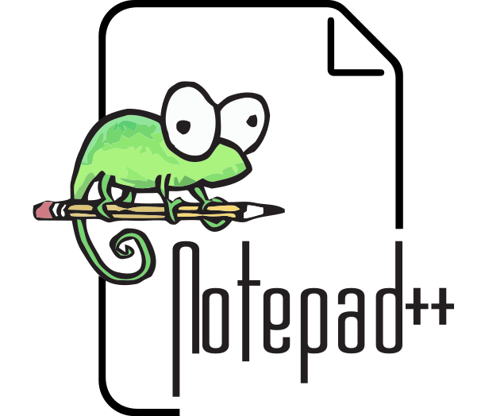

# Notepad++ 

**Website:** [notepad-plus-plus.org](https://notepad-plus-plus.org/)
**Developer:** Don Ho

A free, open-source source code editor and Notepad replacement that supports numerous programming languages. Written in C++ using the Scintilla editing component and Win32 API for optimal performance and small file size.

## Features

- Syntax highlighting for 78+ languages
- Tabbed document interface
- Auto-completion and code folding
- Macro recording
- Plugin support (140+ plugins available)
- Multiple view modes
- Powerful search and replace with regular expressions
- Support for various character encodings

Notepad++ emphasizes being environmentally friendly by reducing CPU usage and power consumption.

<!-- AUTOINDEX:START — managed by update-intranet-indexes.sh; edits inside are overwritten -->
## Files in this folder

_No files in this folder yet._
<!-- AUTOINDEX:END -->
