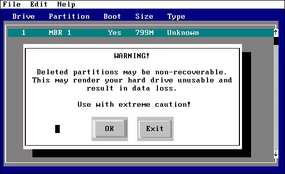

 Windows

**Website:** [upgradenrepair.com/Downloads/delpart](https://www.upgradenrepair.com/Downloads/delpart/delpart.htm)

A partition deletion utility designed for older Windows operating systems. Allows users to delete disk partitions that may be difficult to remove with standard Windows tools.

