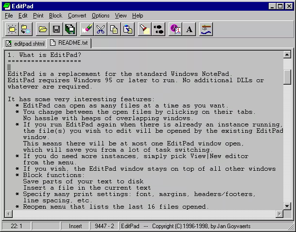

 Windows

**Website:** [editpadclassic.com](https://www.editpadclassic.com/)
**Developer:** Just Great Software (JGsoft)

The text editor that all others were based on (IMO). A small but powerful text editor and Notepad replacement. Compact single executable with a tabbed interface, unlimited file size support, ANSI/OEM conversion, system tray integration, and cross-platform file support (Unix/Mac). EditPad Classic is **postcardware** — free to use after sending the developer a postcard. Succeeded by EditPad Lite and EditPad Pro.

